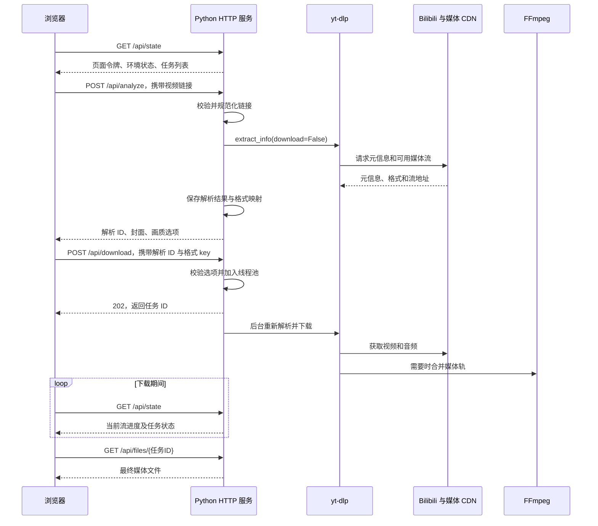
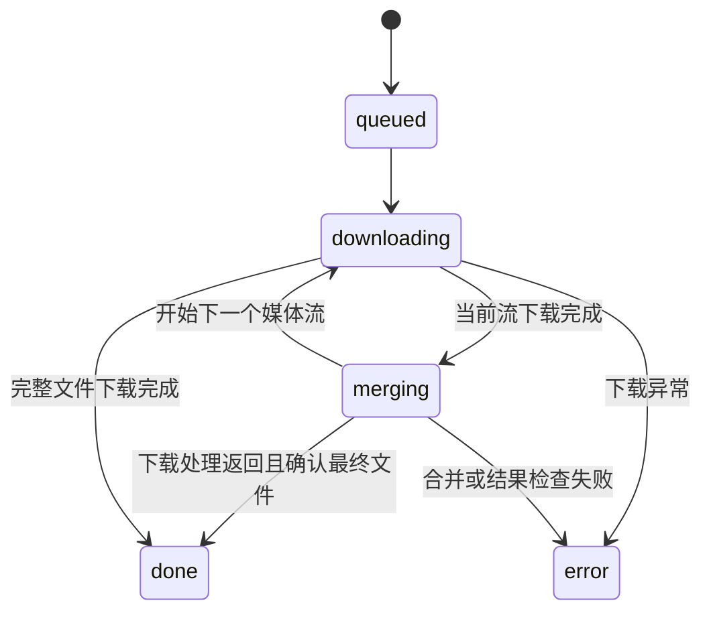

# Bilibili 本地视频下载面板：实现详解

本文主体基于项目提交 `2896ff7` 的实现，分享文案识别和 DRM 错误诊断见文末补充，介绍从链接输入到文件保存的完整流程。项目以 Python 标准库提供本地 HTTP 服务，用 yt-dlp 解析、下载 Bilibili 视频，由 FFmpeg 合并音视频，前端采用原生 HTML、CSS 和 JavaScript。

适用场景是可信用户在自己的电脑或 Termux 环境中操作。当前版本没有数据库、前端构建流程或多用户账户系统。

## 1. 目录与组件职责

```text
bilibili-panel/
├── app.py                   # HTTP 服务、解析、内存状态和下载队列
├── requirements.txt         # yt-dlp==2026.8.19
├── static/
│   ├── index.html           # 中文操作界面
│   ├── style.css            # 桌面与移动端样式
│   └── app.js               # API 请求、轮询、任务及封面渲染
├── tests/
│   └── test_app.py          # 10 项 unittest 测试
├── docs/
│   └── implementation.md    # 本文
├── downloads/               # 任务文件，Git 忽略
└── .venv/                   # Python 虚拟环境，Git 忽略
```

代码入口为 [app.py](../app.py)，界面逻辑位于 [static/app.js](../static/app.js)。服务默认监听 `127.0.0.1:8765`，可用 `PORT` 环境变量修改端口。

| 组件 | 具体职责 |
| --- | --- |
| `ThreadingHTTPServer` | 接收页面、解析、入队、状态和文件请求 |
| `Handler` | 路由、参数检查、JSON 响应和文件传输 |
| `normalize_url()` | 校验、展开短链接、生成规范视频地址 |
| `analyze()` | 调用解析器，整理元信息与画质选项 |
| `ThreadPoolExecutor` | 最多并发执行两个下载任务 |
| `download()` | 下载媒体、更新进度、识别合并结果 |
| yt-dlp | 处理站点接口、媒体格式、请求头、Cookie 和下载 |
| FFmpeg / ffprobe | 合并媒体；检查媒体工具是否可运行 |
| 浏览器 | 输入链接、选择格式、显示任务、保存最终文件 |

## 2. 从链接到文件的流程



这里有两次不同意义的“下载”：第一次是后端把 CDN 媒体保存到服务器本地；第二次是用户点击“保存文件”，浏览器从本地服务获取已完成的文件。关闭浏览器页面不会主动取消后台下载。

## 3. 链接识别与规范化

`normalize_url()` 接受以下输入：

| 输入 | 规范化结果或处理方式 |
| --- | --- |
| `BV1xx411c7mD` | `https://www.bilibili.com/video/BV1xx411c7mD?p=1` |
| `av170001` | `https://www.bilibili.com/video/av170001?p=1` |
| 普通视频链接，带 `?p=2` | 保留分 P 参数，删除其他查询参数 |
| `ep775939` | `https://www.bilibili.com/bangumi/play/ep775939` |
| `/bangumi/play/ep775939` 完整链接 | 保留单集编号，删除查询参数 |
| `https://b23.tv/ep775939` | 验证重定向后转换为单集链接 |

普通视频只保留 `p`，其取值范围是 1～10000，缺省为 1。是否实际存在该分 P，仍由后续解析器判断。单集链接只接受正整数 `ep` 编号，不接受整季 `ss`、媒体页 `md` 或直播地址。

短链接通过自定义 `NoRedirect` 禁止 urllib 自动跟随跳转。收到 301、302、303、307 或 308 后，代码检查 `Location` 的域名，再递归调用 `normalize_url()`。因此，输入短链接不能直接把后端引向任意用户指定地址；当前实现也不支持任意多级短链接跳转。

输入允许的主机为 `bilibili.com`、`www.bilibili.com`、`m.bilibili.com` 和专门处理的 `b23.tv`。代码还检查协议、端口以及 URL 中是否包含用户名或密码。最终传给解析器的是重建后的 HTTPS 地址。

## 4. 格式解析与画质选项

### 4.1 本项目与解析器的分工

面板没有自行实现 Bilibili 的完整接口协议。`options()` 为每次操作创建独立的 `YoutubeDL` 配置：

```python
result = dict(
    quiet=True,
    logger=QuietLogger(),
    noplaylist=True,
    socket_timeout=20,
    retries=2,
    fragment_retries=2,
    cachedir=False,
)
```

其中 `socket_timeout` 是网络操作超时，并非整个解析或下载的总时限。`noplaylist=True` 用于选择单个视频；`analyze()` 还会拒绝解析器返回的 `playlist` 和 `multi_video` 结果。

普通视频的接口签名、番剧单集的播放信息接口以及媒体请求头等细节由 yt-dlp 的 Bilibili extractor 处理。面板调用 `extract_info(url, download=False)`，读取统一后的 `title`、`duration`、`thumbnail` 和 `formats`。

### 4.2 视频轨、音频轨与容器

Bilibili 常见的 DASH 格式会把视频和音频分别提供。解析结果中的关键字段包括：

| 字段 | 面板中的用途 |
| --- | --- |
| `format_id` | 后端生成下载格式选择器 |
| `vcodec` | 判断是否为纯音频，并显示视频编码 |
| `acodec` | 判断所选视频是否还需要配音轨 |
| `height`、`fps` | 补充画质与帧率信息 |
| `format_note` / `format` | 显示平台画质名称 |
| `filesize` / `filesize_approx` | 显示已知或估计大小 |
| `ext` | 显示解析器报告的容器类型 |

`vcodec == 'none'` 的纯音频格式不会进入画质下拉框。若视频格式的 `acodec == 'none'`，后端生成 `<format_id>+bestaudio`；否则直接使用 `<format_id>`。

例如，独立视频轨 `30011` 对应选择器 `30011+bestaudio`。`bestaudio` 的具体选择由 yt-dlp 决定，前端当前没有单独选择音轨的入口。

AVC、HEVC、AV1 是视频编码；AAC 是音频编码；MP4、MKV 是容器。把轨道合并到 MKV 不会把原始编码转成另一种编码，也不会提高画质。部分旧式分段流同样由解析器负责处理，面板不自行拼接字节片段。

### 4.3 为什么不能直接把格式字符串交给前端

后端为每个格式生成 `secrets.token_hex(8)` 随机 key，保存内部映射：

```python
selectors[key] = fid + ('+bestaudio' if f.get('acodec') == 'none' else '')
```

前端只提交 key，后端从当前解析记录中查找真实选择器。用户无法通过下载 API 直接提交任意 yt-dlp 格式表达式。实际流 URL 也不会放入返回给前端的格式列表。

解析 ID 为 `token_hex(16)`，任务 ID 为 `token_hex(12)`。这些标识负责关联数据，不能替代用户身份认证。

### 4.4 画质名称与权限

界面优先显示 `format_note` 或 `format`，没有名称时才使用像素高度。宽画幅内容的实际高度可能低于平台标称画质，例如平台称为 4K 的画面可能不是 2160 像素高，因此两者不能简单等同。

面板只列出当前会话实际获得的流。平台声明“支持 4K”，并不意味着访客请求已经拿到 4K 下载地址。登录 Cookie 与大会员状态会影响可用格式，但代码不会尝试绕过权限。

下拉框中的大小来自单个格式记录，可能仅为视频轨大小，未必包含随后附加的音轨。任务完成后的 `size` 才是最终文件大小。

## 5. Cookie 加载与授权边界

Cookie 文件路径在模块启动时确定，优先级如下：

1. 非空环境变量 `BILI_COOKIES`。
2. 已存在的 `~/.config/bilibili-panel/cookies.txt`。
3. 均未配置时，使用访客模式。

路径通过 yt-dlp 的 `cookiefile` 配置传入。文件采用 Netscape Cookie 格式。当前界面里的“已配置 Cookie”仅表示配置了文件路径，不代表 Cookie 一定有效，也不代表会员状态经过实时验证。

```sh
BILI_COOKIES=/absolute/path/cookies.txt .venv/bin/python app.py
```

本机部署时曾在用户授权下，从 Android App 的 WebView 数据库中读取已有网页 Cookie，验证后写入上述独立文件。这是一次部署操作：仓库没有自动提取 App 凭据、调用 root 或刷新登录的功能。日常运行面板无需 root。App 访问令牌也没有被直接冒充为网页 Cookie。

建议凭据目录权限为 `700`、文件权限为 `600`。Cookie 不返回给浏览器，不写入版本库；但同一系统用户和 root 仍可能读取该文件。yt-dlp 的 Cookie 文件机制也可能将更新后的 Cookie 写回磁盘，不能把这个文件理解为只读输入。

当前下载并发可能让多个 yt-dlp 实例同时使用同一个 Cookie 文件，代码尚未实现专门的 Cookie 写入协调。如果后续扩大并发，应单独设计共享会话与凭据存储。

## 6. 内存状态与下载队列

### 6.1 两类状态

`ANALYSES` 存储解析结果，字段包括：

```text
解析 ID → url、selectors、title、thumbnail、time
```

记录有效期为 1800 秒。每次成功解析时，服务清理过期记录；达到 100 条时移除最早插入的一条。下载入队时还会再次检查记录是否过期。

`JOBS` 存储任务快照，包括任务 ID、标题、封面、状态、进度，以及过程中补充的速度、预计剩余时间、错误、文件名和大小。任务按插入顺序保存，状态接口倒序返回，让新任务显示在上方。

两者都只存在于进程内存。常规重启不会恢复任务，也不会根据磁盘文件重建列表。维护期间曾临时导出和恢复现有任务，但该操作不是当前入口 `python app.py` 的持久化能力。

### 6.2 并发与队列上限

下载由 `ThreadPoolExecutor(max_workers=2)` 执行。提交新任务前，代码统计不处于 `done` 或 `error` 的任务，数量达到 10 时拒绝入队。因此最多是 10 个未完成任务，而非“10 个等待任务加 2 个运行任务”。

`threading.RLock` 保护解析记录、入队判断和状态更新。网络请求与媒体下载不在下载状态更新锁内长时间执行。

HTTP 请求处理采用线程化服务器。两线程限制只约束下载工作池，并不限制同时发起的解析请求数量；当前没有解析并发限额、请求速率限制或完成任务总量上限。

### 6.3 状态与进度



progress hook 使用以下计算方式：

```text
progress = min(99, downloaded_bytes / total_bytes × 100)
```

总大小优先使用 `total_bytes`，缺失时使用估计值；都不存在时进度显示为 0。完成文件检查后才将任务进度设为 100。

这里表示当前流的进度，不是视频、音频、合并全过程的加权进度。视频下载结束后再下载音频，百分比可能重新开始。hook 收到 `finished` 就标记为 `merging`，所以该状态也包含媒体流之间的过渡，不能严格等同于“FFmpeg 正在运行”。前端因此显示“合并 / 处理中”。

## 7. 下载、合并与文件传输

下载任务重新调用 `extract_info(url, download=True)`，而不是长期缓存第一次解析时的 CDN 地址。这样可重新获取临时流地址，但最初选择的格式也可能因权限或平台响应变化而失效；当前实现会报告失败，不会静默降级到另一画质。

每个任务使用独立目录：

```text
downloads/<任务ID>/%(title).120B [%(id)s].%(ext)s
```

标题通过 yt-dlp 模板限制为最多 120 字节；单独的任务目录避免不同任务写入同一路径。任务显示标题可以包含系列名与 ep 编号，而磁盘文件名仍由下载时的 yt-dlp 元信息生成，两者不保证完全相同。

`merge_output_format='mkv'` 指定需要合并时使用 MKV。已包含完整音视频的格式通常保留原容器。下载返回后，代码扫描任务目录，接受 `.mkv`、`.mp4`、`.flv`、`.webm` 文件，排除文件名中匹配 `.f<格式标识>.` 的中间轨道文件，并要求恰好找到一个结果。

文件接口只允许获取 `done` 任务对应的文件，使用 `shutil.copyfileobj()` 分块写入 HTTP 响应，避免把完整视频读入内存。响应包括：

```http
Content-Type: application/octet-stream
Content-Length: <文件字节数>
Content-Disposition: attachment; filename*=UTF-8''<编码后的文件名>
```

浏览器断开连接时，服务捕获断连异常。接口尚未实现 HTTP Range，所以不能把浏览器断点续传视为已有功能。

## 8. HTTP API

所有请求都检查 `Host` 是否为当前端口的 `127.0.0.1` 或 `localhost`。POST 请求还要求携带从状态接口获得的 `X-Panel-Token`，JSON 请求体限制为 1～8192 字节。

| 方法 | 路径 | 用途 | 成功状态 |
| --- | --- | --- | --- |
| GET | `/`、`/app.js`、`/style.css` | 静态页面资源 | 200 |
| GET | `/api/state` | 页面令牌、工具状态、Cookie 配置与任务列表 | 200 |
| POST | `/api/analyze` | 解析单个视频或单集 | 200 |
| POST | `/api/download` | 校验所选格式并入队 | 202 |
| GET | `/api/files/{id}` | 传输已完成的媒体文件 | 200 |

解析请求示例：

```json
{"url": "https://b23.tv/ep775939"}
```

解析响应结构示例，标识和数值均为示意：

```json
{
  "id": "<解析ID>",
  "title": "示例剧集 · 1 · ep775939",
  "uploader": null,
  "duration": 3304.68,
  "thumbnail": "https://i0.hdslb.com/bfs/bangumi/image/example.png",
  "formats": [
    {
      "key": "<格式key>",
      "height": 1920,
      "fps": 25,
      "codec": "hev1.1.6.L153.90",
      "ext": "mp4",
      "note": "4K 超高清",
      "size": null
    }
  ],
  "warnings": []
}
```

入队请求与响应：

```json
{"id": "<解析ID>", "format": "<格式key>"}
```

```json
{"id": "<任务ID>"}
```

错误响应统一使用 `{"error": "错误说明"}`。参数、失效解析记录、队列已满以及解析阶段的 yt-dlp 下载错误通常返回 400；Host 或令牌错误返回 403；不存在的路由或文件返回 404；其他 POST 处理异常返回 502。后台下载失败通过任务的 `status='error'` 与 `error` 字段体现，不改变已经返回的 202。

## 9. 前端轮询与缩略图

[static/app.js](../static/app.js) 使用 `fetch()` 请求 API。`poll()` 等待本次状态刷新完成后，再通过 `setTimeout(poll, 1500)` 安排下一次刷新，因此不是每 1500 毫秒强行叠加一个新请求。

这项轮询只访问本机 `/api/state`，不会每次都重新请求 Bilibili 的播放接口。封面则由浏览器直接向图片服务器请求，与本地状态轮询是两条不同的请求路径。

封面沿以下路径传递：

```text
yt-dlp info.thumbnail
    → analyze() 响应与 ANALYSES
    → 入队时写入 JOBS
    → /api/state
    → updateThumbnail()
```

任务行采用 CSS Grid：桌面封面宽 144 像素，移动端宽 96 像素，图片区域比例为 16:9，使用 `object-fit: cover` 裁剪。番剧海报也会填入这个横向区域，所以可能裁掉海报上下部分。

前端根据任务 ID 复用已有行节点，只更新正文、状态和进度。`row.dataset.thumbnail` 保存当前封面地址；地址未改变时，不重建图片元素。这样避免状态刷新不断重置图片加载。

`updateThumbnail()` 只接受 HTTP / HTTPS 图片地址，并设置：

```javascript
img.loading = 'lazy';
img.decoding = 'async';
img.referrerPolicy = 'no-referrer';
```

封面缺失或加载失败时保留“暂无封面”，不会阻塞任务显示。标题和错误文本通过 `textContent` 写入，避免把视频元信息当作 HTML 执行。图片没有经过后端代理、转码或持久缓存；浏览器缓存行为由图片服务器和浏览器决定。

## 10. 安全措施与当前限制

现有防护包括回环地址监听、Host 校验、POST 页面令牌、输入域名与路径限制、后端生成格式选择器、固定输出目录，以及静态资源路由白名单。

页面令牌通过 `/api/state` 下发，能够约束普通跨站页面发起的写请求，但不是密码或账户系统。能够访问本机端口的程序仍可获取令牌。下载文件 GET 接口没有独立的登录校验，不能直接把服务开放到公网。

`clean_error()` 会将错误中的 HTTP / HTTPS URL 替换为 `[链接]`，并截断至 600 字符。它是基础的 URL 遮盖，不是完整的敏感信息检测器。`QuietLogger` 捕获解析阶段的警告，在页面显示试看或权限提示；下载阶段产生的所有警告尚未单独汇入任务字段。

当前实现还有以下边界：

- 没有任务持久化、取消、删除或自动清理功能，失败下载也可能留下部分文件。
- 合并结果依赖扩展名与文件名筛选，没有在每次任务结束后执行 ffprobe 内容验证。
- 创建任务目录位于下载函数的异常捕获范围之外，若此步骤失败，任务可能停留在等待状态，后续可扩大异常处理范围。
- `JOBS` 不限制已完成任务数量，长期运行可能增加内存与每次状态响应大小。
- 无磁盘配额、解析限流、多用户隔离或专门的反向代理部署配置。
- Cookie 过期、地区限制、接口变化与平台风控仍可导致失败。

本项目的下载权限检查不等于平台对自动化下载行为的授权。Bilibili 的公开协议对自动程序获取内容存在限制，能够下载或拥有大会员不表示没有账号风险。相关规则见[官方用户使用协议](https://www.bilibili.com/blackboard/protocal/licence.html)。

## 11. 运行、验证与排查

### 11.1 安装与启动

进入项目目录后执行：

```sh
python -m venv .venv
.venv/bin/pip install -r requirements.txt
.venv/bin/python app.py
```

系统需安装 FFmpeg 和 ffprobe。`media_ready()` 会实际执行两个工具的 `-version`，每项超时 5 秒，并缓存检查结果。修复依赖后应重启服务。

Termux 中曾遇到宿主进程注入的旧版动态库导致 FFmpeg 无法加载。代码仅过滤 `LD_LIBRARY_PATH` 中包含 `codex-cli-termux` 的条目，保留其他路径。这是针对本机环境的兼容处理，不是对所有动态链接错误的通用修复。

### 11.2 自动测试覆盖范围

```sh
.venv/bin/python -m unittest discover -s tests -v
node --check static/app.js
```

现有 10 项测试覆盖普通链接、分 P、单集、短链接跳转、非法地址、格式选择器、单集标题与警告，以及成功和失败下载状态。

其中媒体解析和下载测试使用 mock，不证明实时 Bilibili 接口可用，也不验证真实 FFmpeg 合并。JavaScript 的 `node --check` 只检查语法。真实链路和浏览器表现需要另外验证。

项目开发期间已完成普通视频与 `ep775939` 单集的真实下载，用 ffprobe 确认音视频轨，比较文件接口与磁盘文件的 SHA-256，并使用 Chromium 检查移动端任务封面。这些是特定环境下的验证记录，不是所有视频或网络环境的可用性保证。

### 11.3 常见问题定位

| 现象 | 优先检查 |
| --- | --- |
| 只显示低画质 | Cookie 是否有效、账号权限、实际返回的格式 |
| 显示已配置 Cookie，但高清仍不可用 | 此状态只检查配置，不验证登录；需另行确认会话 |
| 解析结果过期 | 超过 30 分钟或服务重启，重新解析 |
| FFmpeg 不可运行 | 工具安装、动态库、ffprobe，修复后重启 |
| 进度回退 | 是否正在从视频轨切换至音频轨 |
| 任务列表在重启后为空 | 内存状态已清空，磁盘文件仍需到 downloads 查找 |
| 封面显示占位图 | 原始元信息是否有图片、图片服务器是否可访问 |
| 下载完成但浏览器不能播放 | 原始视频编码与播放器兼容性；MKV 合并不做转码 |

## 12. 后续可演进方向

如需长期运行，可优先将任务元数据写入 SQLite，启动时将未完成任务标记为中断，并建立已完成文件索引。随后补充取消与清理接口、磁盘配额、解析并发控制和明确的合并后校验。

画质界面还可以区分“平台声明支持”和“当前会话可下载”的档位，显示登录或会员要求；音轨也可独立选择。相关元数据需要在解析层可靠取得，不能仅根据缺少某个格式推断权限原因。

这些属于后续设计，当前仓库尚未实现。

## 13. 分享文案识别与 DRM 失败诊断补充

输入支持从一段分享文案中提取单个 HTTP / HTTPS 链接，并移除常见的末尾中文标点；存在多个链接时拒绝处理。提取后的链接仍经过原有域名、路径与短链接跳转校验。

当单集的 `extract_info()` 抛出 `DownloadError` 时，`episode_failure_reason()` 复用该 yt-dlp 实例及其 Cookie，查询官方 `/pgc/player/web/v2/playurl` 接口。若 `video_info.is_drm` 为真，则返回明确的 DRM 不支持提示；如果诊断请求失败或没有确认 DRM，则保留原始解析异常。该逻辑只诊断失败原因，不请求解密密钥、许可证，也不绕过 DRM。

新增 4 项测试覆盖分享文案、DRM 提示、诊断失败保留原错误，以及非 DRM 情况保留原错误；测试总数现为 14 项。
